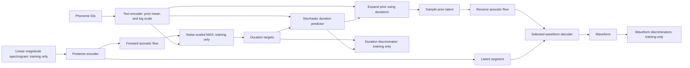

# Architecture and selected configurations

The internal systems use a VITS/Piper-inspired implementation with selected
VITS2 components. The author reports an independent reimplementation, while
several utility comments describe adaptations from upstream code. The inspected
Piper Git revision is an external reference, not a proven common ancestor.



The text encoder, posterior encoder, flow, SDP, generator, waveform/duration
discriminators, MAS source and losses are included as reference components.
The selected JSON configs are extracted from checkpoint metadata, not inferred
from the current YAML templates. No training entry point is promised.

| Component | Selected internal configuration |
|---|---|
| Text encoder | 256 symbols, 192 channels, 6 layers, 2 heads, FFN 768 |
| Posterior encoder | 513 linear STFT bins; training only |
| Acoustic flow | Four coupling blocks with Transformer conditioning |
| Duration | Stochastic predictor; duration discriminator during training |
| Upsampling | Initial channels 256; strides 8/8/4; kernels 16/16/8 |
| Baseline | HiFi-GAN ResBlock2, parallel kernels 3/5/7; LeakyReLU |
| Parallel-IR | Three parallel IR branches, kernels 3/5/7, expansion 1/1/1; SnakeBeta |
| Sequential-IR | Two sequential IR blocks per stage, kernel 3, expansion 1/1/1; SnakeBeta |
| Adversaries | Existing waveform discriminators; MRD additionally used by IR runs |
| Excluded from selected runs | F0 conditioning and Vocos |

Baseline, Parallel-IR and Sequential-IR differ in training recipe as well as
decoder. MRD, activations, gradient clipping, numerical guards and split history
are confounders. The external Piper model also has a different acoustic flow and
training recipe. This repository does not frame these as topology-only ablations.

For optional structural inspection after installing the `architecture` extra:

```python
from hifimobinet.architecture.factory import build_synthesizer
model = build_synthesizer("sequential-ir")  # random initialization, not TTS weights
```

This creates the architecture only. Actual demo inference uses the identified
Q05 ONNX graph and never substitutes random initialization for missing weights.
